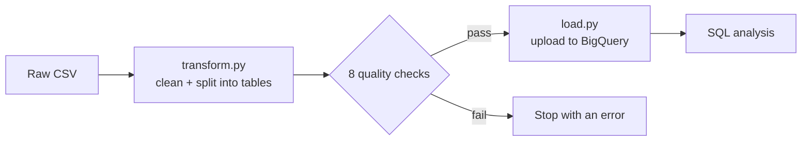

# Facebook Ads Pipeline

Batch ETL pipeline gathers raw Facebook ad campaign data, reorganizes into campaign, ad set, and ad levels, then checks for problems before loading into BigQuery to use SQL for finding where ad money "paid" off.

## TL;DR

My biggest discovery is the inverse relationship between click-through rate and conversion rate. Clicking more didn't mean buying more.

| Audience | Click-through rate | Conversion rate | Share of spend | Share of purchases | Ad cost per sale |
|---|---|---|---|---|---|
| Women 45–49 | 0.025% (highest) | 1.2% (lowest) | 22.9% | 10.4% | \$119.94 |
| Men 30–34 | 0.012% (lowest) | 6.8% (highest) | 13.0% | 27.7% | \$25.55 |

*Conversion rate is approved conversions (purchases) per click. Some purchases came from ads with no clicks, so it's an approximation.*

The inverse relationship is seen in these two groups. Women aged 45–49 clicked on ads the most often, but few of their clicks turned into sales, which resulted in each purchase costing \$119.94 of the ad spend budget. Men aged 30–34 clicked least often, but made the most purchases, which resulted in each purchase costing only \$25.55.

## Why I built this

Rather than just clean a CSV and make some charts, I wanted to practice pipelines and data warehousing with real-world scenarios and applications. Using the Facebook ad dataset gave me a glimpse at the kind of ad data Meta's business runs on.

## How it works



1. **Explore** (`notebooks/01_explore.ipynb`): I looked at the data before changing anything and wrote down what I noticed.
2. **Transform** (`src/transform.py`): Renames columns, splits the one flat file into three tables, rounds spend to cents, and runs quality checks.
3. **Load** (`src/load.py`): Uploads the three tables to BigQuery with explicit column types.
4. **Analyze** (`sql/`): Three SQL queries that answer business questions.

## The data

The dataset is [Clicks Conversion Tracking on Kaggle](https://www.kaggle.com/datasets/loveall/clicks-conversion-tracking): 1,143 real (anonymized) Facebook ads from one company's social media campaigns. Each row has the ad's targeting (age, gender, interest) and its results (impressions, clicks, spend, conversions, and approved conversions). Conversions are inquiries about the product, and approved conversions are purchases.

## Structure

While exploring the data, I noticed a pattern with the `fb_campaign_id` values. Every row with the same `fb_campaign_id` had the same age, gender, and interest. So while the column name calls it a campaign, it's really an ad set – the audience-targeting level in Meta's real ads system.

The data further showed three levels: three campaigns, 691 ad sets, and 1,143 ads. I then made a star schema that matched that structure:

| Table | One row per | Rows | What's in it |
|---|---|---|---|
| `dim_campaign` | campaign | 3 | campaign ID |
| `dim_ad_set` | ad set | 691 | campaign, age group, gender, interest code |
| `fact_ad_performance` | ad | 1,143 | impressions, clicks, spend, conversions |

Before building the schema, I double-checked that every ad set did map to exactly one audience. If not, the joined tables would have miscounted ads and miscalculated totals without triggering an error message.

## Cleaning decisions

- **Conversions without clicks:** One of the first things I noticed while exploring was the 204 ads that had conversions (inquiries) but no clicks, and 71 of those also had approved conversions (purchases). Had I deleted these rows like I originally considered, I would have missed data from likely view-through conversions, where someone sees an ad, doesn't click, and acts later. To account for the zero clicks, I measured purchases per 1,000 impressions alongside per click.
- **Pay per click:** The ads with zero clicks also had zero spend. This suggests these ads were billed per click.
- **Skewed numbers:** The average impressions were misleading. Some ads had millions of impressions while the median was around 51,000, so I compared groups using rates instead.
- **Raw spend values:** Small rounding errors in spend values were corrected to cents.

## Quality checks

Before saving anything, `transform.py` checks 8 rules, including unique IDs in every table, clicks never exceeding impressions, spend being zero exactly when clicks are zero, and joined tables returning every ad exactly once. If any check fails, the pipeline stops with an error. The load step replaces each table instead of adding to it, so running the pipeline twice never creates duplicate rows.

## Findings

- **The campaign that accounted for almost all of the ad spend was the least efficient.** Campaign 1178 used 94.8% of the total ad spend but cost \$63.83 per sale. Campaign 916 cost only \$6.24 per sale, but due to its small count of just 54 ads, that result is less certain to hold up.
- **One audience worked at real scale.** Ad set 144533 (men 30–34, interest code 16) spent \$542 and got 37 sales at \$14.65 each, about four times cheaper than its campaign's average.
- **Ages 30–34 drove the cheapest results.** 9 of the 10 ad sets with the lowest cost per sale targeted ages 30–34, matching the audience segment results.

## A mistake I almost made

When I initially wrote and ran the "top ad sets" query, I ranked ad sets by cost per sale. This returned a misleading result set that looked good, but only pulled ad sets that spent \$10–\$22 and had 1–4 sales. These small numbers can hide the true winners.

To account for this, I modified the query to only include ad sets with at least five sales. Every ad set that qualified came from campaign 1178, the only campaign with ad sets large enough to judge. Ad set 144533 ranked third by cost per sale ($14.65), but the two ahead of it had only 7 and 8 sales. With 37 sales at nearly the same cost, 144533 is the more believable top performer.

## What I learned

- Even if data looks wrong, it doesn't always mean it is. The conversions without clicks looked wrong, but they were likely real consumer behavior.
- Choose metrics carefully. Clicks and purchases told different stories.

## How to run it

You'll need Python and a Google Cloud project with BigQuery (the free sandbox works).

```bash
git clone https://github.com/rmoore98/facebook-ads-pipeline.git
cd facebook-ads-pipeline
python -m venv .venv
source .venv/Scripts/activate      # on Mac/Linux: source .venv/bin/activate
pip install -r requirements.txt
gcloud auth application-default login
python src/transform.py
python src/load.py
```

`load.py` uses my project ID by default. To use your own, set the `GCP_PROJECT_ID` environment variable and create a dataset named `facebook_ads`. Then run the queries in `sql/` in the BigQuery console.

## Project structure

```
facebook-ads-pipeline/
├── data/
│   ├── raw/          # original CSV, never edited
│   └── processed/    # the three cleaned tables
├── notebooks/        # exploration
├── src/
│   ├── transform.py  # clean, split, and check the data
│   └── load.py       # upload to BigQuery
├── sql/              # analysis queries
└── requirements.txt
```

## Tools

Python, pandas, Google BigQuery, SQL, Git
